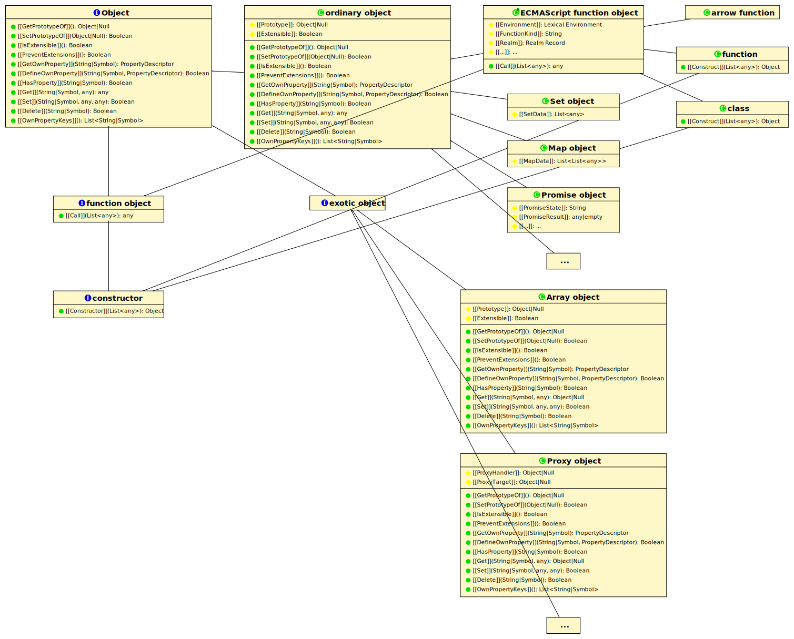

# 如何阅读 ECMAScript 规范

在线版，2020-3-28

**当前版本**：[https://timothygu.me/es-howto/](https://timothygu.me/es-howto/)

**问题跟踪**：  
    [GitHub](https://github.com/TimothyGu/es-howto/issues/)  
    [本文中提供的issues地址](https://timothygu.me/es-howto/#issues-index)

**作者**：[Timothy Gu](https://timothygu.me/) [timothygu99@gmail.com](timothygu99@gmail.com)

## 提要

如果你想学习JavaScript复杂的工作原理的话，那么ECMAScript语言规范(又名JavaScript规范，或ECMA-262)是一个非常好的资源文献。然而，当你刚开始看到那巨量的文字篇幅时，你可能会望而却步。而本文编写的目的就是为了让你以一种更简单的方式去阅读这本最佳的JavaScript语言参考规范。

## 目录

<!-- vscode-markdown-toc -->
*  [[§] 1. 序](#1.)
	* [[§] 1.1. 为什么需要阅读ECMAScript规范](#1.1.ECMAScript)
	* [§ 1.2. 哪些属于ECMAScript规范，哪些不属于](#1.2.ECMAScript)
	* [§ 1.3. 在进一步讨论之前，ECMAScript规范在哪里?](#1.3.ECMAScript)
	* [§ 1.4. 规范导航](#1.4.)
*  [§ 2. 运行时语义](#2.)
	* [§ 2.1. 算法步骤](#2.1.)
	* [§ 2.2. 抽象操作](#2.2.)
	* [§ 2.3. `[[This]]` 是什么？](#2.3.This)
		* [§ 2.3.1. Record 字段](#2.3.1.Record)
		* [§ 2.3.2. JavaScript对象的内部槽](#2.3.2.JavaScript)
		* [§ 2.3.3. JavaScript对象的内部方法](#2.3.3.JavaScript)
	* [§ 2.4 `Completion Records` 及特殊符号 `?` 和 `!`](#2.4CompletionRecords)
	* [§ 2.5. JavaScript Objects](#2.5.JavaScriptObjects)
	* [§ 2.6. 示例: String.prototype.substring()](#2.6.String.prototype.substring)
	* [§ 2.7. 示例: `Boolean()` 与 `String()` 会抛出异常么?](#2.7.BooleanString)
	* [§ 2.8. 示例: `typeof` 运算符](#2.8.typeof)
* [§ 术语表](#3.)
	* [§ 常见的抽象操作](#3.1.)
* [§ 术语索引](#4.)
	* [§  规范定义的术语](#4.1.)
* [§ 参考](#5.)
	* [§ 参考文献](#5.1)
* [§ ISSUS](#ISSUS)

<!-- vscode-markdown-toc-config
	numbering=true
	autoSave=true
	/vscode-markdown-toc-config -->
<!-- /vscode-markdown-toc -->

## <a name='1.'></a>[§] 1. 序

ECMAScript规范每天阅读一点点，健康快乐多一点！阅读规范也许这是你的新年愿望，亦或是某个医生开的处方（开个玩笑😂）。总之，不管出于什么原因，欢迎欢迎!

> **注:** 在本文中，我将使用术语“ECMAScript”来指代规范本身，而在其他地方使用“JavaScript”。然而，总体上这两个术语指的是同一件事。(ECMAScript和JavaScript之间有一些历史上的区别，但这超出了本文的讨论范围，你可以[google一下轻松了解这些区别](https://www.google.com/search?q=ecmascript+vs.+javascript)。)  

### <a name='1.1.ECMAScript'></a>[§] 1.1. 为什么需要阅读ECMAScript规范  

ECMAScript规范是所有JavaScript实现的权威参考资料。无论JavaScript是运行在你的浏览器[[什么是我的浏览器]](https://timothygu.me/es-howto/#biblio-whatismybrowser)，还是在你的Node.js服务器上 [[NODEJS]](https://timothygu.me/es-howto/#biblio-nodejs)，亦或是在你的物联网设备上[[JOHNNY-FIVE]](https://timothygu.me/es-howto/#biblio-johnny-five)，都要遵循ECMAScript规范。所有JavaScript引擎的开发人员也都依赖于该规范进行开发，以确保他们的新特性能够像其他JavaScript引擎一样按照预期的方式工作。  
但我认为该规范不仅仅对“JavaScript引擎开发人员”这种大神有用，实际上它对普通的JavaScript程序员同样非常有用，只是你还没有意识到而已。

假设有一天你在工作中发现了下列奇怪的现象

```javascript
> Array.prototype.push(42)
1
> Array.prototype
[ 42 ]
> Array.isArray(Array.prototype)
true
> Set.prototype.add(42)
TypeError: Method Set.prototype.add called on incompatible receiver #<Set>
    at Set.add (<anonymous>)
> Set.prototype
Set {}
```

一个方法能在它的原型上工作，而另一个方法却不能在它的原型上工作，为什么？你是不是非常困惑？而更不幸的是，[google在你最需要它的时候也无法帮助你](https://www.google.com/search?q=array+prototype+push+on+prototype)，同样，[无所不能的Stack Overflow也会对此束手无策](https://stackoverflow.com/search?q=array+prototype+push+on+prototype)。
**但阅读ECMAScript规范会帮助到你喔！**

或者，你可能想知道‘臭名昭著’的[松散相等操作符](https://developer.mozilla.org/en-US/docs/Web/JavaScript/Reference/Operators/Comparison_Operators#Equality_operators)(==)是如何真正发挥作用的(“function”这个词这里也是松散使用[[WAT]](https://timothygu.me/es-howto/#biblio-wat))。而当曾经那个勤奋的你在MDN上找到它时，只会发现它的[解释段落](https://developer.mozilla.org/en-US/docs/Web/JavaScript/Reference/Operators/Comparison_Operators#Using_the_Equality_Operators)伤眼而又无助[MDN]。
**但阅读ECMAScript规范会帮助到你喔！**

另一方面，我不建议刚接触JavaScript的开发人员阅读ECMAScript规范。如果你是JavaScript新手，那就先玩玩Web吧!先构建一些web应用程序，或者一些基于javascript的保姆摄像头！或任何JavaScript东西！当你趟过了足够多的JavaScript的坑或者变得经验丰富而不必担心JavaScript时，在考虑回到本文档。

OK，现在你知道了，规范是非常有用的工具，而且可以帮助你理解语言或平台的复杂性。那么ECMAScript规范的范围究竟包括哪些内容呢?

### <a name='1.2.ECMAScript'></a>§ 1.2. 哪些属于ECMAScript规范，哪些不属于

规范上对这个问题的回答是“只有语言特性才属于了ECMAScript规范”。说了又好像没说，因为这就像是在说“JavaScript特性就是JavaScript”。我不喜欢这种重复又无聊的说法!  [[XKCD-703]](https://timothygu.me/es-howto/#biblio-xkcd-703)

相反，我要做的是列出一些在JavaScript应用中常见的东西，并告诉你它们是否是一种语言特性。  

*语法元素的语法(比如 `for...in` 循环这种)*&emsp; &emsp; &emsp; &emsp; &emsp; &emsp;&emsp; &emsp;&emsp; &emsp;&emsp;&emsp; ✔

---

*语法元素的语义(比如 `typeof null` 或 `{ a: b }` 的返回)*&emsp; &emsp; &emsp;&emsp; &emsp;&emsp;&emsp;✔  

---
*`import a from 'a';`* &emsp; &emsp; &emsp; &emsp; &emsp; &emsp; &emsp; &emsp; &emsp; &emsp; &emsp; &emsp; &emsp;&emsp;&emsp;&emsp; &emsp;&emsp;&emsp;❓[1]  

---

*[Object](https://tc39.es/ecma262/#sec-object-objects), [Array](https://tc39.es/ecma262/#sec-array-objects), [Function](https://tc39.es/ecma262/#sec-function-objects), [Number](https://tc39.es/ecma262/#sec-number-objects), [Math](https://tc39.es/ecma262/#sec-math-object), [RegExp](https://tc39.es/ecma262/#sec-regexp-regular-expression-objects),  
[Proxy](https://tc39.es/ecma262/#sec-proxy-objects), [Map](https://tc39.es/ecma262/#sec-map-objects), [Promise](https://tc39.es/ecma262/#sec-promise-objects), [ArrayBuffer](https://tc39.es/ecma262/#sec-arraybuffer-objects), [Uint8Array](https://tc39.es/ecma262/#sec-typedarray-objects), [globalThis](https://tc39.es/ecma262/#sec-globalthis), ...*&emsp;&emsp;&emsp; &emsp;&emsp;&emsp; ✔  

---

*console, setTimeout(), setInterval(), clearTimeout(), clearInterval())*&emsp;&emsp;&emsp;✘[2]  

---

*[Buffer](https://nodejs.org/api/buffer.html#buffer_class_buffer), [process](https://nodejs.org/api/globals.html#globals_process), [global*](https://nodejs.org/api/globals.html#globals_global)*&emsp; &emsp; &emsp; &emsp; &emsp; &emsp; &emsp; &emsp; &emsp; &emsp; &emsp; &emsp; &emsp;&emsp; &emsp; &emsp; &emsp;&emsp;✘[3]  

---

*[module](https://nodejs.org/api/modules.html#modules_module), [exports](https://nodejs.org/api/modules.html#modules_exports), [require()](https://nodejs.org/api/modules.html#modules_require), [__dirname](https://nodejs.org/api/modules.html#modules_dirname), [__filename](https://nodejs.org/api/modules.html#modules_filename)*&emsp; &emsp; &emsp; &emsp; &emsp; &emsp; &emsp; &emsp; ✘[4]  

---

*[window](https://html.spec.whatwg.org/multipage/window-object.html#dom-window), [alert()](https://html.spec.whatwg.org/multipage/timers-and-user-prompts.html#dom-alert), [confirm()](https://html.spec.whatwg.org/multipage/timers-and-user-prompts.html#dom-confirm),  
 the DOM ([document](https://html.spec.whatwg.org/multipage/window-object.html#dom-document-2), [HTMLElement](https://html.spec.whatwg.org/multipage/dom.html#htmlelement), [addEventListener()](https://dom.spec.whatwg.org/#dom-eventtarget-addeventlistener), [Worker](https://html.spec.whatwg.org/multipage/workers.html#worker), ...)*&emsp;&emsp;✘[5]  

---

>[1] ECMAScript规范指定了这些声明的语法以及它们的含义，但没有指定模块应该如何加载。
>
>[2] 这些东西在浏览器和Node.js中都可用，但都是非标准的。对于Node.js，它们是由[它的文档](https://nodejs.org/api/globals.html#globals_global_objects)指定的。对于浏览器，[console](https://console.spec.whatwg.org/#namespacedef-console)由Console标准[[CONSOLE]](https://timothygu.me/es-howto/#biblio-console)指定，而其余的由HTML标准[[HTML]](https://timothygu.me/es-howto/#biblio-html)指定。
>
>[3] 这些都是仅限于node .js的全局变量，由其对应文档指定。*请注意，与global不同的是，[globalThis](https://tc39.es/ecma262/#sec-globalthis)是ECMAScript的一部分，并且浏览器中也实现了。
>
>[4]这些是仅限于node .js模块范围的“globals”，由其文档指定。
>
>[5] 这些都是仅针对浏览器的内容。

### <a name='1.3.ECMAScript'></a>§ 1.3. 在进一步讨论之前，ECMAScript规范在哪里?  

当你[google“ECMAScript规范”](https://www.google.com/search?q=ecmascript+specification)时，你会搜索到非常多的结果，它们看起来都是正规合法的规范。那你应该选择哪一个呢?  

**要是嫌下面的说法太长就不要读了！！！在 tc39.es/ecma262/ 发布的规范多半就是你想要的**[[ECMA-262]](https://timothygu.me/es-howto/#biblio-ecma-262)。

详细点的说法:

ECMAScript语言规范是由一群来自不同背景的人开发的，他们被称为 Ecma International Technical Committee 39(或者更熟悉的说法是TC39 [[TC39]](https://timothygu.me/es-howto/#biblio-tc39))。TC39维护了ECMAScript语言的最新规范TC39.es [[ECMA-262]](https://timothygu.me/es-howto/#biblio-ecma-262)。  

复杂化的是，每年TC39都会选择一个时间点来获取该规范的快照，并附上一个版本号，也就成为了当年的ECMAScript语言标准。例如，ECMAScript®2019语言规范(ECMA-262，第十版) [[ECMA-262-2019]](https://timothygu.me/es-howto/#biblio-ecma-262-2019) (通常被称为 ES10 或 ES2019 ) 是2019年6月 tc39.es [[ECMA-262]](https://timothygu.me/es-howto/#biblio-ecma-262)上的规范。该规范被放入福尔马林中，再经过适当的压缩包装处理，用于永久存档。  

因此，除非你想让你的web应用程序只运行在2019年6月的浏览器上，否则你总是希望查看最新的规范 tc39.es [[ECMA-262]](https://timothygu.me/es-howto/#biblio-ecma-262)。但如果你想(或必须)支持旧的浏览器或Node.js版本，那么参考旧的规范可能会有帮助。  

>注:ISO/IEC还将ECMAScript语言标准重新发布为ISO/IEC 22275 [[ISO-22275-2018]](https://timothygu.me/es-howto/#biblio-iso-22275-2018)。不过不用担心，因为该标准基本上是一个到[[ECMA-262]](https://timothygu.me/es-howto/#biblio-ecma-262)的超链接。  

### <a name='1.4.'></a>§ 1.4. 规范导航  

ECMAScript规范谈论了**非常多**的东西。即使它的作者尽力把它分成有逻辑的块，但仍然还有巨大的文本阅读量。  

我个人而言，喜欢将规范分为五个部分:  

* 约定和基础(“什么是Number?当规范说‘抛出TypeError异常’时，它是什么意思?”)
* 该语言的语法产物(“如何编写for-in循环?”)
* 语言的静态语义(“如何在var语句中确定变量名?”)
* 语言的运行时语义(“for-in循环是如何执行的?”)
* APIs(“String.prototype.substring()接口做了什么?”)  

但是规范并不是这样组织的。相反，它在 [§5 符号约定](https://tc39.es/ecma262/#sec-notational-conventions)和 [§9 普通与特殊的对象行为](https://tc39.es/ecma262/#sec-ordinary-and-exotic-objects-behaviours)中提出了第一个要点，在[§10 ECMAScript语言:源代码](https://tc39.es/ecma262/#sec-ecmascript-language-source-code)和[§15 ECMAScript语言:脚本与模块](https://tc39.es/ecma262/#sec-ecmascript-language-scripts-and-modules)中以交错的方式提出了另三个要点：

>* [§13.6 if语句声明](https://tc39.es/ecma262/#sec-if-statement)语法产物
>   * §13.6.1-6 静态语义
>   * §13.6.7 运行时语义
>* [§13.7 迭代语句语法生成](https://tc39.es/ecma262/#sec-iteration-statements)  
>   * §13.7.1 共享静态与运行时语义  
>   * §13.7.2 do-while 声明
>     * §13.7.2.1-5 静态语义  
>     * §13.7.2.1-5 运行时语义  
>   * §13.7.3 while 声明  
>     * ...  

而API则通过 [§18 全局对象](https://tc39.es/ecma262/#sec-global-object),[§26 反射](https://tc39.es/ecma262/#sec-reflection)展开。  

我想说的是，绝对没有人会从头到尾地阅读规范。相反，我们只需要查看与我们试图寻找的内容相对应的部分，并在该部分中查看我们需要的内容。试着确定你的问题与五大部分中的哪一个相关;如果你无法确定是哪一个，问你自己这个问题“这是在什么时候运算的(无论你想确定什么)?”这样可能会更有帮助。不要太担心，通过练习，使用规范会变得更容易。  

## <a name='2.'></a>§ 2. 运行时语义  

语言运行时语义和APIs是规范中最大的部分，通常也是我们最关心的部分。  

总的来说，阅读这些部分是非常简单的。但是，该规范使用了许多的简写对刚开始使用的人来说是非常棘手的(至少对我来说)。下面我将尝试解释其中的一些约定，然后将它们应用到一个常规的工作流中，来弄清楚这些是如何工作的。  

### <a name='2.1.'></a>§ 2.1. 算法步骤  

ECMAScript中的大多数运行时语义都是由一系列算法步骤指定的，这与伪代码没什么不同，但形式要精确得多。  

>例1:
>
> 一个算法步骤的样本集如下:  
>
> 1. 将 a 设置为 1.  
> 2. 将 b 设置为 a+a.  
> 3. if b 是 2, 那么
>       1. 哇哦! 算法没问题.
> 4. Else
>       1. 啊哦! 出问题了！

>延伸阅读: [§5.2 算法的约定](https://tc39.es/ecma262/#sec-algorithm-conventions)

### <a name='2.2.'></a>§ 2.2. 抽象操作

有时你会在规范中看到某些像是函数调用的东西。比如Boolean()函数的第一步是:  

>当使用参数value调用 Boolean 时，执行以下步骤:
>
> 1. 将 b 设置为 ! [ToBoolean](https://tc39.es/ecma262/#sec-toboolean) (value).  
> 2. ...

这个“ToBoolean”函数被称为一个 ***抽象操作*** 。之所以称它为抽象操作，是因为它实际上并没有真正的这么个函数公开暴露给JavaScript代码。它只是规范编写者发明的一种符号，只是为了让他们不用一遍又一遍地写同样的东西。

>注:现在，不要担心看不懂在ToBoolean之前的!。我们将在 [§ 2.4 `Completion Records` 及特殊符号 `?` 和 `!`](#24-completion-records-及特殊符号--和-) 中讨论它

>延伸阅读: [§5.2.1抽象操作](https://tc39.es/ecma262/#sec-algorithm-conventions-abstract-operations)

### <a name='2.3.This'></a>§ 2.3. `[[This]]` 是什么？

有时候，你可能会看到 ***`[[符号]]`*** 就像“把proto设置为obj.\[[Prototype]]”那样被使用。根据它出现的上下文，这个符号在技术上可以表示几种不同的东西，但你可能要花费很长时间才能理解，其实这个符号指的是某些无法通过JavaScript代码观察到的内部属性。  

准确地说，它可以表示三种不同的东西，我将用规范中的示例来说明这一点。不过，现在可以跳过它们了。

#### <a name='2.3.1.Record'></a>§ 2.3.1. Record 字段

ECMAScript规范使用`Record`这个术语来指代具有一组固定键的键值映射——有点像c语言中的structure。`Record`的每个键值对称为一个字段。因为`Record`只能出现在规范中，而不能出现在实际的JavaScript代码中，所以使用 ***`[[符号]]`*** 引用[Record](https://timothygu.me/es-howto/#record)的[字段](https://timothygu.me/es-howto/#record-field)是有意义的。  

>例2:
>
>值得注意的是，[属性描述符](https://tc39.es/ecma262/#sec-property-descriptor-specification-type)`[[Value]]`， `[[Writable]]`， `[[Get]]`， `[[Set]]`， `[[Enumerable]]`和`[[Configurable]]`这些字段都是基于[Record](https://timothygu.me/es-howto/#record)实现。[抽象操作](#-22-抽象操作) [IsDataDescriptor](https://tc39.es/ecma262/#sec-isdatadescriptor) 广泛使用这种表示法:  
>
>当使用[属性描述符](https://tc39.es/ecma262/#sec-property-descriptor-specification-type) *Desc* 调用抽象操作IsDataDescriptor 时，需要执行以下步骤:  
>
> 1. 如果 *Desc* is **undefined**, 返回 **false**.  
> 2. 如果 *Desc*.\[[Value]] 与 *Desc*.\[[Writable]] 都不存在的话, 返回 **false**.
> 3. 返回 **true**.

在下一节中可以找到[Records](https://timothygu.me/es-howto/#record)的另一个具体例子，[§ 2.4 `Completion Records` 及特殊符号 `?` 和 `!`](#24-completion-records-及特殊符号--和-)  

>延伸阅读: [§6.2.1 列表和 Record 规范类型](https://tc39.es/ecma262/#sec-list-and-record-specification-type)

#### <a name='2.3.2.JavaScript'></a>§ 2.3.2. JavaScript对象的内部槽  

JavaScript对象可能会有一些所谓的[内部槽](https://timothygu.me/es-howto/#internal-slot)，而规范会使用这些槽来保存数据。像[Record字段](https://timothygu.me/es-howto/#record-field)那样，这些内部槽不能用JavaScript观察到，但可能其中的一些会通过特定的工具（如谷歌Chrome的DevTools）暴露出来。因此，使用[`[[符号]]`](https://timothygu.me/es-howto/#double-brackets-notation)来描述内部槽也是有意义的。  

[内部槽](https://timothygu.me/es-howto/#internal-slot)的细节将在[§ 2.5 JavaScript对象](https://timothygu.me/es-howto/#javascript-objects) 中讨论。现在，不要太担心它们的用途，先请注意下面的示例。  

>例3:
>
>大多数JavaScript对象都有 \[[Prototype]]这么一个内部槽，它引用了当前对象所继承的对象。这个内部槽的值通常也就是[Object.getPrototypeOf()](https://developer.mozilla.org/en-US/docs/Web/JavaScript/Reference/Global_Objects/Object/getPrototypeOf#)方法返回的值。在[抽象操作](#-22-抽象操作) [OrdinaryGetPrototypeOf](https://tc39.es/ecma262/#sec-ordinarygetprototypeof)中，这个内部槽的值会被访问:  
>
>当对象O调用抽象操作 OrdinaryGetPrototypeOf 时，将执行以下步骤:
>
> 1. 返回 `O.[[Prototype]]`.  

>注:对象的内部槽与[Record](https://timothygu.me/es-howto/#record-field)在外观上是相同的，但无论它是一个对象还是一个[Record](https://timothygu.me/es-howto/#record)，都可以通过查看这个表示法的实例主体(出现在'.'之前的部分)来消除歧义。从上下文环境来看通常是很容易区别的。

#### <a name='2.3.3.JavaScript'></a>§ 2.3.3. JavaScript对象的内部方法  

JavaScript对象也有所谓的内部方法。像[内部槽](https://timothygu.me/es-howto/#internal-method)一样，这些[内部方法](https://timothygu.me/es-howto/#internal-method)不能通过JavaScript直接观察到。因此，使用[`[[符号]]`](https://timothygu.me/es-howto/#double-brackets-notation)来描述内部方法也是有意义的。  

[内部方法](https://timothygu.me/es-howto/#internal-method)的细节将在[§ 2.5 JavaScript对象](https://timothygu.me/es-howto/#javascript-objects)中介绍。现在，不要太担心它们的用途，但请注意下面的示例。  

>例4:
>
>所有JavaScript函数都有一个`[[Call]]`内部方法来运行该函数。这个[Call](https://tc39.es/ecma262/#sec-call)的[抽象操作](#-22-抽象操作)有以下步骤:  
>
> 1. `Return ? F.[[Call]](V, argumentsList).`  
>
> 其中F是一个JavaScript函数对象。在这种情况下，F的`[[Call]]`内部方法通过用参数V和argumentsList调用自身。  

>注意:[`[[符号]]`](https://timothygu.me/es-howto/#double-brackets-notation)的第三种含义与其他含义的区别在于，它看起来更像一个函数调用。

### <a name='2.4CompletionRecords'></a>§ 2.4 `Completion Records` 及特殊符号 `?` 和 `!`  

ECMAScript规范中的每个运行时语义都会显式或隐式地返回一个 ***Completion Record*** 结果。这个Completion Record可能拥有三种字段:  

* 一个字段是 `[[Type]]` (Type可能是normal, return, throw, break, or continue其中的一个)  
* 如果 `[[Type]]` 是 normal,return或 throw的话, 那么它可能还有个字段是 `[[Value]]` (返回或者抛出的值)
* 如果 `[[Type]]` 是 break 或 continue的话, 当脚本执行break或continue作为运行时语义的结果时，它可以有选择地携带一个被称为`[[Target]]`的标签，

>注意:双括号用来表示 [Record](https://timothygu.me/es-howto/#record) [字段](https://timothygu.me/es-howto/#record-field)。关于“Record”及其相关的符号，请参见[§ 2.3.1 Record 字段](#-231-record-字段)。

`[[Type]]`为normal的[Completion Record](https://timothygu.me/es-howto/#completion-record)被称为 ***normal completion*** 。除了normal completion之外，所有其他的Completion Record都被称为 ***abrupt completion*** 。

大多数时候，你只会处理`[[Type]]`为throw的abrupt completion。其他三种abrupt completion只用于了解某些特定的句法元素是如何运行的。实际上，你也不会在内置函数的定义中看到他们，因为break/continue/return不能跨函数工作。

>延伸阅读: [§6.2.3 Completion Record规范类型](https://tc39.es/ecma262/#sec-completion-record-specification-type)

✧  ✧  ✧  ✧  ✧  ✧   ✧   ✧   ✧   ✧   ✧   ✧   ✧   ✧   ✧   ✧  

由于Completion Record的定义，JavaScript中的一些细节，比如错误冒泡在 try-catch块出现前是不存在的。事实上，错误(或者更精确地说，abrupt completions)都是显式处理的。  

如果没有任何简写的话，一个普通调用抽象操作的文本说明将会是下面这样（该抽象操作可能返回计算结果，也可能抛出错误）:

>例5:
>
>没有任何简写的抽象操作调用可能是这几个步骤:  
>
>1. 把 resultCompletionRecord 设置为 AbstractOp().
>      
>      >注意:resultCompletionRecord是一个[Completion Record](https://timothygu.me/es-howto/#completion-record)。
>      
>2. 如果resultCompletionRecord 是 abrupt completion，则返回resultCompletionRecord。
>      
>      >注意:这里，如果是abrupt completion，resultCompletionRecord将被直接返回。换句话说，AbstractOp中抛出的错误将被转发，剩余的步骤将被中止。
>      
>3. 把 *result* 设置为 resultCompletionRecord.\[[value]]。
>     
>     >注意:在确保我们得到一个 normal completion 后，我们可以通过展开[Completion Record](https://timothygu.me/es-howto/#completion-record)来获得我们需要的实际计算结果。
>     
>4. *result* 就是我们想要的结果。现在，我们可以用它做更多的事情啦。
>
>这可能会唤醒你在C语言中的手动错误处理的记忆:
>
>```javascript  
>  int result = abstractOp();              // Step 1
>  if (result < 0)                         // Step 2
>    return result;                        // Step 2 (continued)
>                                          // Step 3 is unneeded
>  // func() succeeded; carrying on...     // Step 4
>```
>
>##  

但是为了减少这样笨重而又样板化的步骤，ECMAScript规范的编辑者添加了一些简写。自ES2016以来，相同的规范文本可以用以下两种等价的方式来写:

>例6:
>
>以下几个步骤会调用一个抽象操作，该操作可能会抛出[***ReturnIfAbrupt***](https://timothygu.me/es-howto/#abstract-opdef-returnifabrupt):
>
>1. 把 *result* 设置为 AbstractOp().
>    
>    >注:这里，就像前面例子中的第1步一样，*result*是一个[Completion Record](https://timothygu.me/es-howto/#completion-record)。
>    
>2. [ReturnIfAbrupt](https://timothygu.me/es-howto/#abstract-opdef-returnifabrupt)(result).
>    
>    >注:[ReturnIfAbrupt](https://timothygu.me/es-howto/#abstract-opdef-returnifabrupt)通过转发处理abrupt completions ，并自动将 *result* 展开为它的\[[Value]]。
>    
>3. *result* 就是我们需要的结果。现在我们可以用它做更多的事情啦。

或者，更准确地说，用特殊的问号(?)符号表示:  

>例7:
>
>通过一个问号(?)将抽象操作结果抛出，分为下面这几个步:
>
>1. 把 *result* 设置为 ? AbstractOp()
>    
>    >注意:在这个表示法中，我们根本不去处理Completion Records。这个 ? 简写可以帮我们处理所有的事情，并且这个*result*可以立即使用。
>    
>2. *result*就是我们所想要的。现在我们可以用它做更多的事情啦。

✧  ✧  ✧  ✧  ✧  ✧   ✧   ✧   ✧   ✧   ✧   ✧   ✧   ✧   ✧   ✧

如果当我们知道一个AbstractOp的特定调用一定不会返一个abrupt completion时，我们还想向读者传递更多的关于规范意图信息的话，那我们就会使用感叹号(`!`):  

>例8:
>
>通过加一个感叹号(`!`)，该抽象操作的abrupt completions将永远不会被抛出，分为下面这几个步:
>
>1. 把 *result* 设置为 ! AbstractOp().
>    
>    >注: `?` 会转发所有可能得到的错误，而`!`则会断言我们从这个调用中永远不会得到abrupt completions，如果得到了，那将是规范中一个bug。和?的情况一样，我们根本不会去处理 Completion Records 。并且*result*可以立即使用。
>    
>2. *result*就是我们需要的。现在我们可以用它做更多的事情啦。
>
>**小心！**
>不可否认的，`!`它看起来像一个有效的JavaScript表达式，这个可能会让令人困惑:
>> 1. 把 b 设置为 ! ToBoolean(value).
>>  — 摘至 [Boolean()](https://tc39.es/ecma262/#sec-boolean-constructor-boolean-value).
> 这里`!`仅仅意味着我们确信对ToBoolean的调用永远不会返回异常，而不是取相反的结果!

>延伸阅读: [§5.2.3.4 ReturnIfAbrupt 简写](https://tc39.es/ecma262/#sec-completion-record-specification-type)

### <a name='2.5.JavaScriptObjects'></a>§ 2.5. JavaScript Objects

在ECMAScript中，一部分在讲每个对象都有的内部方法集，而规范的其余部分就是在讲通过调用这些方法来执行特定的任务。所有对象都有以下几个内部方法:

* `[[Get]]`，获取对象的属性(例如 `obj.prop`)
* `[[Set]]`，设置一个对象的属性(例如 `obj.prop = 42;`)
* `[[GetPrototypeOf]]`，获取对象的原型(即 `Object.GetPrototypeOf(obj)`)
* `[[GetOwnProperty]]`，它获取一个对象自身的属性描述符(例如，`Object.getOwnPropertyDescriptor(obj, "prop")`)
* `[[Delete]]`，用于删除对象上的属性(例如 `delete obj.prop`)

(详细的说明在[§6.1.7.2对象内部方法和内部插槽](https://tc39.es/ecma262/#sec-object-internal-methods-and-internal-slots)中可以找到)

根据这个定义，***function objects***(或者说“functions”)也只是些简单的对象，只不过这些对象另外具有\[[Call]]内部方法，也可能还有\[[Construct]]内部方法。也因此它们被称为 ***可调用对象***。

该规范将所有对象分为两个大块:[普通对象](https://timothygu.me/es-howto/#ordinary-object)和[特殊对象](https://timothygu.me/es-howto/#exotic-object)。你遇到的大多数对象都是 ***普通对象***，这意味着它们所有的[内部方法](https://timothygu.me/es-howto/#internal-method)都是[§9.1 普通对象内部方法和内部槽](https://tc39.es/ecma262/#sec-ordinary-object-internal-methods-and-internal-slots)中规定的默认方法。  

然而，ECMAScript规范还定义了几种[特殊对象](https://timothygu.me/es-howto/#exotic-object)，这些对象可能重写了这些内部方法的默认实现。对于这些特殊对象允许做什么，规范是有一些明确的最低限度的限制的。然而通常在不违背规范的情况下，重写内部方法已经可以玩出很多花样来了。  

>例9:
>
>[Array](https://tc39.es/ecma262/#sec-array-objects)对象就是这些[特殊对象](https://timothygu.me/es-howto/#exotic-object)的一种。Array对象的`length`属性的某些特殊语义是不能通过普通对象的可用手段来实现的。
>
>其中一个就是，通过设置Array对象的`length`属性就可以实现从这个Array对象中删除属性的功能，而`length`属性似乎只是一个普通的数据属性。相反，`new Map().size`只是一个在`Map.prototype`上指定的`getter`函数，并且不具有像`[].length`那样具有魔法般的属性。
>
>```javascript  
>   > const arr = [0, 1, 2, 3];
>   >console.log(arr);
>   [ 0, 1, 2, 3 ]
>   arr.length = 1;
>   console.log(arr);
>   [ 0 ]
>   console.log(Object.getOwnPropertyDescriptor([], "length"));
>   { value: 1,
>     writable: true,
>     enumerable: false,
>     configurable: false }
>```
>
>```javascript  
>   > console.log(Object.getOwnPropertyDescriptor(new Map(), "size"));
>   undefined
>   > console.log(Object.getOwnPropertyDescriptor(Map.prototype, "size"));
>   { get: [Function: get size],
>     set: undefined,
>     enumerable: false,
>     configurable: true }
>```
>
>这个行为是通过重写 `[[DefineOwnProperty]]` 内部方法来实现的。详见[§9.4.2 数组对象](https://tc39.es/ecma262/#sec-array-exotic-objects)。

ECMAScript规范还允许其他规范定义它们自己的特殊对象。正是通过这种机制，才规定了浏览器对[跨域API访问的权限](https://developer.mozilla.org/en-US/docs/Web/Security/Same-origin_policy#Cross-origin_script_API_access)的限制(见[WindowProxy](https://html.spec.whatwg.org/multipage/window-object.html#windowproxy)) [[HTML]](https://timothygu.me/es-howto/#biblio-html)。JavaScript程序员也可以通过[Proxy](https://tc39.es/ecma262/#sec-proxy-objects)这个API创建他们自己的特殊对象。  

✧  ✧  ✧  ✧  ✧  ✧   ✧   ✧   ✧   ✧   ✧   ✧   ✧   ✧   ✧   ✧

JavaScript对象也可以通过定义 ***内部槽*** 来包含某些特定类型的值。我倾向于把[***内部槽***](https://timothygu.me/es-howto/#internal-slot)看作是Symbol命名的属性，它们隐藏在Object.getOwnPropertySymbols()中。普通对象和特殊对象都允许拥有[内部槽](https://timothygu.me/es-howto/#internal-slot)。

>在[§ 2.3.2 JavaScript对象的内部槽](#-232-javascript对象的内部槽)中，我提到了 ***大多数*** 对象都有一个叫做`[[Prototype]]`的内部槽(事实上，所有普通对象，甚至一些特殊对象(如Array对象)都有它)。但我在上面也曾简要地描述过有一个名为`[[GetPrototypeOf]]`的内部方法。它们有什么区别呢?
>
>关键字是 ***“大多数”*** :区别在于大多数对象都有`[[Prototype]]`内部槽，而所有对象是都实现了`[[GetPrototypeOf]]`这个内部方法。值得注意的是，[Proxy](https://tc39.es/ecma262/#sec-proxy-objects)对象没有自己的`[[Prototype]]`，它的`[[GetPrototypeOf]]`内部方法要么遵从于已注册的处理程序，要么遵从于目标对象的原型，并且被存储在[Proxy](https://tc39.es/ecma262/#sec-proxy-objects)对象的`[[ProxyTarget]]`内部槽中。
>出于这个原因，当在处理对象时，最好的办法是去参考合适的[内部方法](https://timothygu.me/es-howto/#internal-method)而不是直接查看[内部槽](https://timothygu.me/es-howto/#internal-slot)。

✧  ✧  ✧  ✧  ✧  ✧   ✧   ✧   ✧   ✧   ✧   ✧   ✧   ✧   ✧   ✧  

对于对象、内部方法和内部插槽之间关系，我们也可以换另一种思维方式。那就是经典的面向对象视角。“对象”就像一个接口，规定了几个必须实现的[内部方法](https://timothygu.me/es-howto/#internal-method)。普通对象提供了内部方法的默认实现，而特殊对象则部分或完全重写了这些实现。另一方面，[内部槽](https://timothygu.me/es-howto/#internal-slot)就像对象的实例变量（即对象的实现细节）。

所有这些关系都可以用下面的UML图来概括(点击放大):

  

### <a name='2.6.String.prototype.substring'></a>§ 2.6. 示例: String.prototype.substring()  

现在我们已经比较理解规范是如何组织和编写的了，那接下来让我们来练习一下!  
假设我现在有一个问题:

>在不运行代码的情况下，下面的代码片段返回什么?
>
>>String.prototype.substring.call(undefined, 2, 4)  
>

这个问题相当棘手。看起来可能有两个似乎合理的结果:  

1. `String.prototype.substring()`可能会首先将undefined转换为字符串“undefined”，然后取出字符串位置2和3的字符(即间隔[2,4))，**导致**结果为`“de”`。
2. 另一种可能是，`String.prototype.substring()`可能会**抛出错误**，直接拒绝**undefined**作为输入。

不幸的是，当**this**值不是字符串时，[MDN](https://developer.mozilla.org/en-US/docs/Web/JavaScript/Reference/Global_Objects/String/substring#)也没有提供出关于该函数行为的任何可参考说明。  

那还得是ECMAScript规范来救场!在规范[ECMA-262]的左上角的搜索框中输入`substring`后，我们就会看到[§21.1.3.22 String.prototype.substring(start, end)](https://tc39.es/ecma262/#sec-string.prototype.substring)，这才是该函数如何工作的标准规范。

在阅读算法步骤之前，我们先想想我们知道了什么。假设我们已经基本了解了`str.substring()`是如何工作的，其实就是返回了给定字符串的一部分。在**this**值没有定义的情况下，它是如何运行的呢，这个是现在不确定的。所以，我们会专门地去寻找算法步骤中处理**this**值的步骤。  

幸运的是，[String.prototype.substring()](https://tc39.es/ecma262/#sec-string.prototype.substring)算法的第一步就专门处理了**this**值:

>1. 把 O 设置为 ? [RequireObjectCoercible](https://tc39.es/ecma262/#sec-requireobjectcoercible)(**this** value).

这个`?`简写可以让我们得出结论:在某些情况下，[RequireObjectCoercible](https://tc39.es/ecma262/#sec-requireobjectcoercible)[抽象操作](#-22-抽象操作)可能会抛出异常，否则用`!`就可以了。如果它抛出一个错误，那么它将与我们上面提的第二个假设相对应! 带着这个想法，我们点开超链接，来看看[RequireObjectCoercible](https://tc39.es/ecma262/#sec-requireobjectcoercible)到底做了什么。

[抽象操作](#-22-抽象操作) [RequireObjectCoercible](https://tc39.es/ecma262/#sec-requireobjectcoercible)看起来有点奇怪。与大多数抽象操作不同，它是通过表而不是算法步骤来定义的:

>| Argument Type（参数类型） | Result（结果）        |
>| ------------- |:-------------:|
>| Undefined     | Throw a TypeError exception.（抛出一个类型错误异常） |
>| ...           | ...      |

不管怎样-在Undefined(我们传递给substring()的**this**值的类型)对应的这一行中，规范指明[RequireObjectCoercible](https://tc39.es/ecma262/#sec-requireobjectcoercible)将会抛出一个异常。又因为`?`符号在函数定义中使用，于是我们就知道抛出的异常一定会冒泡到函数调用的地方。OK，搞定!

于是这样我们就有了答案: **给定的代码片段会抛出一个TypeError异常**。

>该规范只规定了抛出的Error类型，而并包含具体的Error message。这意味着具体实现可以有不同的Error message，甚至可能是本地化的Error message。
>
>例如，在谷歌的V8 6.4上(包含在谷歌Chrome 64中)，message是
>
>```javascript  
>   TypeError: String.prototype.substring called on null or undefined
>```
>
>在Mozilla Firefox 57.0 上给出了更少的有用信息
>
>```javascript  
>   TypeError: can’t convert undefined to object
>```
>
>而与此同时，ChakraCore 1.7.5.0版本(微软Edge中的JavaScript引擎)采用了V8的路线却抛出了
>
>```javascript  
>   TypeError: String.prototype.substring: 'this' is null or undefined
>```
>

### <a name='2.7.BooleanString'></a>§ 2.7. 示例: `Boolean()` 与 `String()` 会抛出异常么?  

当在编写任务中重要且关键的代码时，我们通常会将异常处理会放在编码的首要位置。所以，*“我现在用的这个内置函数是不是会抛出异常呢?”* 这样的问题，我们经常会考虑。

在这个例子中，我们会通过Boolean()和String()这两个语言内置函数来尝试回答这样的问题。我们将只关注对这两个函数的直接调用，而不是`new Boolean()`和`new String()`这种包装函数的情况（这种包装函数是JavaScript中最不受欢迎的特性之一，几乎也是所有JS指南都不鼓励的做法）[[YDKJS]](https://timothygu.me/es-howto/#biblio-ydkjs)。

在导航到规范中的`Boolean()`部分后，我们可以看到相当短的算法:

>当使用*value*参数调用Boolean时，将执行以下步骤:
>
>1. 将 *b* 设为 ! ToBoolean(value)。
>2. 如果NewTarget 是 **undefined**, 则将返回 *b*.
>3. 将 *O* 设为 ? [OrdinaryCreateFromConstructor](https://tc39.es/ecma262/#sec-ordinarycreatefromconstructor)(NewTarget, "%**BooleanPrototype**%", « `[[BooleanData]]` »).
>4. 将 *b* 设置为 *O*.\[[BooleanData]] .
>5. 返回 *O*.

然而看起来好像并没有那么简单，涉及到了一些关于[OrdinaryCreateFromConstructor](https://tc39.es/ecma262/#sec-ordinarycreatefromconstructor)的复杂技巧。另外，更重要的是在第3步中还有一个`?`的简写，这表明这个函数在某些情况下还有可能会抛出错误。让我们来仔细看看吧。  

*步骤 1* 将*value*(函数参数)强制转换为Boolean值。有趣的是，这一步没有`?`或`!`简写，但没有一个Completion Record的缩写通常意味着要加一个`!`。所以*步骤 1*不能抛出异常。

*步骤 2* 检查[NewTarget](https://timothygu.me/es-howto/#abstract-opdef-newtarget)是否是**undefined**。**NewTarget**与`new.target`（为ES2015首次添加的元属性）在规范上是等价的，目的是让规范能够区分是`new Boolean()`调用(此时NewTarget为`Boolean`)还是`Boolean()`调用(此时NewTarget为**undefined**)。因为我们现在只需要关注对`Boolean()`的直接调用，所以我们知道NewTarget的值总是**undefined**，且算法不需要任何额外的处理直接返回*b*。  

因为不需要考虑 `new` 调用的情况，所以当调用`Boolean()`时只会访问`Boolean()`算法中的前两个步骤，而这两个步骤都不会抛出异常，所以我们得出结论，无论输入是什么，**Boolean()都不会抛出异常**。  

✧  ✧  ✧  ✧  ✧  ✧   ✧   ✧   ✧   ✧   ✧   ✧   ✧   ✧   ✧   ✧

OK，让我们把注意力再转向[String()](https://tc39.es/ecma262/#sec-string-constructor-string-value):

>当用参数*value*调用String时，将执行以下步骤:
>
>1. 如果调用这个函数时没有传递参数, 那就将 *s* 设为 `""`.
>2. 其他情况：
>
    >>1. 如果NewTarget为**undefined**且[Type](https://tc39.es/ecma262/#sec-ecmascript-data-types-and-values)(*value*)为Symbol类型，则返回[SymbolDescriptiveString](https://tc39.es/ecma262/#sec-symboldescriptivestring)(*value*)。
    >>2. 将 *s* 设为 ? [ToString](https://tc39.es/ecma262/#sec-tostring)(value).
>
>3. 如果NewTarget为**undefined**，则返回*s*。
>4. 返回 ? [StringCreate](https://tc39.es/ecma262/#sec-stringcreate)(*s*, ? [GetPrototypeFromConstructor](https://tc39.es/ecma262/#sec-getprototypefromconstructor)(NewTarget, `"%StringPrototype%"`)).

根据分析Boolean()函数的相关经验，对于当前的情况，我们可以知道NewTarget也始终应该为**undefined**，因此最后一步可以跳过。同时我们还知道[Type](https://tc39.es/ecma262/#sec-ecmascript-data-types-and-values)和[SymbolDescriptiveString](https://tc39.es/ecma262/#sec-symboldescriptivestring)也是安全的，因为它们都不会处理abrupt completions。然而，在调用[ToString](https://timothygu.me/es-howto/#abstract-opdef-tostring)[抽象操作](#-22-抽象操作)之前，仍然有一个泄密者--`?`。让我们来仔细看看吧。  

就像我们早些时候看到的 [RequireObjectCoercible](https://tc39.es/ecma262/#sec-requireobjectcoercible)一样，[ToString](https://timothygu.me/es-howto/#abstract-opdef-tostring)(*argument*)也是用一个表定义的:  

>| Argument Type (参数类型) | Result （结果）       |
>| ------------- |:-------------:|
>| Undefined     | 返回 `"undefined"`. |
>| Null          | 返回 `"null"`. |
>| Boolean       | 如果*argument*为 **true**, 返回 `"true"`. 如果*argument*为 **false**,返回 `"false"`. |
>| Number        | 返回[NumberToString](https://tc39.es/ecma262/#sec-numbertostring)(argument). |
>| String        | 返回 *argument*. |  
>| Symbol        | 抛出 **TypeError** 异常. |  
>| Object        | 应采取下面的步骤: 1. 将 *primValue* 设为? [ToPrimitive](https://tc39.es/ecma262/#sec-toprimitive)(*argument*, hint String). 2. 返回 ? ToString(*primValue*).|  

在[String()](https://tc39.es/ecma262/#sec-string-constructor-string-value)中调用[ToString](https://timothygu.me/es-howto/#abstract-opdef-tostring)时，*value*可以是除Symbol(在前面的步骤中已经被过滤掉了)以外的任何值。然而，在Object这一行中仍然还是有两个`?`。我们可以通过这个链接找到[ToPrimitive](https://tc39.es/ecma262/#sec-toprimitive)以及其他的东西，而且事实上，如果*value*是一个Object的话，将会有很多抛出错误的机会:

>例10
>几个[String()](https://tc39.es/ecma262/#sec-string-constructor-string-value)抛出异常的例子
>
>```javascript  
>// Spec stack trace:
>//   OrdinaryGet step 8.
>//   Ordinary Object’s [[Get]]() step 1.
>//   GetV step 3.
>//   GetMethod step 2.
>//   ToPrimitive step 2.d.
>
>String({
>  get [Symbol.toPrimitive]() {
>    throw new Error("Breaking JavaScript");
>  }
>});
>```
>
>```javascript  
>// Spec stack trace:
>//   GetMethod step 4.
>//   ToPrimitive step 2.d.
>
>String({
>  get [Symbol.toPrimitive]() {
>    return "Breaking JavaScript";
>  }
>});
>```
>
>```javascript  
>// Spec stack trace:
>//   ToPrimitive step 2.e.i.
>
>String({
>  [Symbol.toPrimitive]() {
>    throw new Error("Breaking JavaScript");
>  }
>});
>```
>
>```javascript  
>// Spec stack trace:
>//   ToPrimitive step 2.e.iii.
>
>String({
>  [Symbol.toPrimitive]() {
>    return { "breaking": "JavaScript" };
>  }
>});
>```
>
>```javascript  
>// Spec stack trace:
>//   OrdinaryToPrimitive step 5.b.i.
>//   ToPrimitive step 2.g.
>
>String({
>  toString() {
>    throw new Error("Breaking JavaScript");
>  }
>});
>```
>
>```javascript  
>// Spec stack trace:
>//   OrdinaryToPrimitive step 5.b.i.
>//   ToPrimitive step 2.g.
>
>String({
>  valueOf() {
>    throw new Error("Breaking JavaScript");
>  }
>});
>```
>
>```javascript  
>// Spec stack trace:
>//   OrdinaryToPrimitive step 6.
>//   ToPrimitive step 2.g.
>
>String(Object.create(null));
>```

因此，对于String()，我们的结论是：**对于原始值它永远不会抛出异常，但对于Object则可能会抛出错误**。

### <a name='2.8.typeof'></a>§ 2.8. 示例: `typeof` 运算符  

到目前为止，我们只分析了API函数，是时候让我们尝试一些不同的东西了！！

>ISSUE 1 未完待续 [<https://github.com/TimothyGu/es-howto/issues/2>](<https://github.com/TimothyGu/es-howto/issues/2>)

##  <a name='3.'></a>§ 术语表  

### <a name='3.1'></a>§ 常见的抽象操作  

***ArrayCreate (length [， proto]) [(spec)](https://tc39.es/ecma262/#sec-arraycreate)***
>创建一个长度为 *length* 的数组对象，将proto作为\[[Prototype]][内部槽](https://timothygu.me/es-howto/#internal-slot)的值。如果未指定proto，则使用[当前领域](https://tc39.es/ecma262/#current-**realm**)中的[%ArrayPrototype%](https://tc39.es/ecma262/#sec-properties-of-the-array-prototype-object)。如果Array构造函数和它的所有属性都没有被打上猴子补丁，并且proto没有被指定或者%ArrayPrototype%在[当前领域](https://tc39.es/ecma262/#current-**realm**)中的话，那么将等价于`new Array(length)`。

***Call ( F, V [ , argumentsList ] ) [(spec)](https://tc39.es/ecma262/#sec-call)***
***Construct ( F [ , argumentsList [ , newTarget ] ] ) [(spec)](https://tc39.es/ecma262/#sec-construct)***
***Get ( O, P ) [(spec)](https://tc39.es/ecma262/#sec-get-o-p)***
***HasProperty ( O, P ) [(spec)](https://tc39.es/ecma262/#sec-hasproperty)***
>在 *F* 或 *O* 上调用相应的[内部方法](https://timothygu.me/es-howto/#internal-method)，并将其余参数转发。等价于[Reflect](https://tc39.es/ecma262/#sec-reflect-object)对象上的相应方法。

***DefinePropertyOrThrow ( O, P, desc ) [(spec)](https://tc39.es/ecma262/#sec-definepropertyorthrow)***
***DeletePropertyOrThrow ( O, P ) [(spec)](https://tc39.es/ecma262/#sec-deletepropertyorthrow)***
>在 *O* 上分别调用相应的[内部方法](https://timothygu.me/es-howto/#internal-method)(`[[DefineOwnProperty]]`和`[[Delete]]`)，并将其余参数转发，如果操作失败且[内部方法](https://timothygu.me/es-howto/#internal-method)返回 **false**，则抛出异常。

***GetV ( V, P ) [(spec)](https://tc39.es/ecma262/#sec-getv)***
返回[Get](https://timothygu.me/es-howto/#abstract-opdef-get)(V, P)，必要的话，*V*将首先通过[ToObject](https://timothygu.me/es-howto/#abstract-opdef-toobject) 转换为一个对象。相当于`V[P]`。

***HasOwnProperty ( O, P ) [(spec)](https://tc39.es/ecma262/#sec-hasownproperty)***
通过调用`O.[[GetOwnProperty]](P)`来返回*O*是否有一个名为P的属性。相当于[Object.prototype.hasOwnProperty](https://tc39.es/ecma262/#sec-object.prototype.hasownproperty).call(O, P)。  

***Invoke ( V, P [ , argumentsList ] ) [(spec)](https://tc39.es/ecma262/#sec-invoke)***
将 *argumentsList* 作为参数列表，调用 *V* 上名为 *P* 的方法。相当于`V[P](…argumentsList)`。与[Call](https://timothygu.me/es-howto/#abstract-opdef-call)不同，这里的 *P* 是一个属性键。

***IsArray ( argument ) [(spec)](https://tc39.es/ecma262/#sec-isarray)***
返回 *argument* 是否为[数组](https://tc39.es/ecma262/#sec-array-objects)[特殊对象](https://timothygu.me/es-howto/#exotic-object)，或者*argument*是否为[Proxy](https://tc39.es/ecma262/#sec-proxy-objects) [特殊对象](https://timothygu.me/es-howto/#exotic-object)，参数最内层的`[[ProxyTarget]]`[内部槽](https://timothygu.me/es-howto/#internal-slot)是否为[数组](https://tc39.es/ecma262/#sec-array-objects)[特殊对象](https://timothygu.me/es-howto/#exotic-object)。相当于[Array.isArray](https://tc39.es/ecma262/#sec-array.isarray)(*argument*)。

***IsCallable ( argument ) [(spec)](https://tc39.es/ecma262/#sec-iscallable)***
返回 *argument* 是否为可调用对象(或称为函数对象)。相当于`typeof argument === 'function'` (document.All要除外，因为这是一个具有一些特殊行为的特殊对象;参见[§B.3.7 内部槽`[[IsHTMLDDA]]`](https://tc39.es/ecma262/#sec-IsHTMLDDA-internal-slot))。

***IsConstructor ( argument ) [(spec)](https://tc39.es/ecma262/#sec-isconstructor)***
返回c是否为带有`[[Construct]]`[内部方法](https://timothygu.me/es-howto/#internal-method)的[函数对象](https://timothygu.me/es-howto/#function-object)。

***ReturnIfAbrupt ( argument ) [(spec)](https://tc39.es/ecma262/#sec-returnifabrupt)***
检查 *argument* 是否为 [abrupt completion](https://timothygu.me/es-howto/#abrupt-completion)(比如一个抛出的异常)，如果是，则返回该[abrupt completion](https://timothygu.me/es-howto/#abrupt-completion)(并允许异常向上冒泡)。另外，如果参数是 [normal completion](https://timothygu.me/es-howto/#normal-completion)，则将`Completion Record`展开，并将 *`argument`* 设置为 *`argument.[[Value]]`*。
又见 [§ 2.4 `Completion Records` 及特殊符号 `?` 和 `!`](#24-completion-records-及特殊符号--和-)

***StringCreate ( value, prototype ) [(spec)](https://tc39.es/ecma262/#sec-stringcreate)***
返回一个与String *value*对应的包装字符串对象，包装对象的内部槽`[[Prototype]]`作为*prototype*。如果*prototype*是当前领域的%StringPrototype%，则等价于 new [String](https://tc39.es/ecma262/#sec-string-constructor-string-value)(value)。

***ToBoolean ( argument ) [(spec)](https://tc39.es/ecma262/#sec-toboolean)***
返回 *argument* 被强制转化为布尔值。相当于*`!!argument`*。

***ToInteger ( argument ) [(spec)](https://tc39.es/ecma262/#sec-tointeger)***
返回 [ToNumber](https://timothygu.me/es-howto/#abstract-opdef-tonumber)(*argument*)，然后被四舍五入截断成为整数。相当于 [Math.trunc](https://tc39.es/ecma262/#sec-math.trunc)(*argument*)。

***ToInt8 ( argument ) [(spec)](https://tc39.es/ecma262/#sec-toint8)***
***ToUint8 ( argument ) [(spec)](https://tc39.es/ecma262/#sec-touint8)***
***ToInt16 ( argument ) [(spec)](https://tc39.es/ecma262/#sec-toint16)***
***ToUint16 ( argument ) [(spec)](https://tc39.es/ecma262/#sec-touint16)***
***ToInt32 ( argument ) [(spec)](https://tc39.es/ecma262/#sec-toint32)***
***ToUint32 ( argument ) [(spec)](https://tc39.es/ecma262/#sec-touint32)***
返回 *argument* 被截断转换为指定位和符号的整数。

***ToUint8Clamp ( argument ) [(spec)](https://tc39.es/ecma262/#sec-touint8clamp)***
返回通过舍入和夹紧原则将*argument*转换为[0,255]范围的整数。

***ToNumber ( argument ) [(spec)](https://tc39.es/ecma262/#sec-tonumber)***
返回将 *argument* 强制转换为Number值。相当于 *`+argument`*。

***ToObject ( argument ) [(spec)](https://tc39.es/ecma262/#sec-toobject)***
返回将 *argument* 强制转换为Object类型值，必要时将使用封装函数封装为对象。与 *`Object(argument)`* 等价，参数为 **undefined** 或为 **null** 的情况除外。

***ToPrimitive ( input [ , PreferredType ] ) [(spec)](https://tc39.es/ecma262/#sec-toprimitive)***
返回将 *argument* 强制转换为原始值(例如，非Object类型值)，如果有*PreferredType*，则返回时需要参考该类型提示输出。这个抽象操作的确切语义会因*PreferredType*的不同而不同。

***ToString ( argument ) [(spec)](https://tc39.es/ecma262/#sec-tostring)***
返回将 *argument* 强制转换为一个String类型值。相当于 *\`${argument}\`*。

>必须注意的是，*`String(argument)`* 和 *`argument + ''`* 都不完全等同于[ToString](https://timothygu.me/es-howto/#abstract-opdef-tostring)。[String()](https://tc39.es/ecma262/#sec-string-constructor-string-value)将Symbol的值转换为它们的String描述，而[ToString](https://timothygu.me/es-howto/#abstract-opdef-tostring)对Symbol会抛出异常。当加法运算符试图将值转换为String类型值时，会调用一些其他函数，如 `argument[Symbol.toPrimitive]`

***Type ( argument ) [(spec)](https://tc39.es/ecma262/#sec-ecmascript-data-types-and-values)***
返回 *argument* 的类型。

## <a name='4.'></a>§ 术语索引

### <a name='4.1.'></a>§  规范定义的术语
[!](#24-completion-records-及特殊符号--和-),
[?](#24-completion-records-及特殊符号--和-),
[abrupt completion](#24-completion-records-及特殊符号--和-),
[abstract operation](#-22-抽象操作),
[ArrayCreate](#a-name31a§-常见的抽象操作),
[break](#24-completion-records-及特殊符号--和-),
[Call](#a-name31a§-常见的抽象操作),
[callable object](#-25-javascript-objects),
[Completion Record](#24-completion-records-及特殊符号--和-),
[Construct](#a-name31a§-常见的抽象操作),
[continue](#24-completion-records-及特殊符号--和-),
[DefinePropertyOrThrow](#a-name31a§-常见的抽象操作),
[DeletePropertyOrThrow](#a-name31a§-常见的抽象操作),
[double brackets notation](#-23-this-是什么),
[exotic object](#-25-javascript-objects),
[field](#-231-record-字段),
[function object](#-25-javascript-objects),
[Get](#a-name31a§-常见的抽象操作),
[GetV](#a-name31a§-常见的抽象操作),
[HasOwnProperty](#a-name31a§-常见的抽象操作),
[HasProperty](#a-name31a§-常见的抽象操作),
[internal method](#-25-javascript-objects),
[internal slot](#-25-javascript-objects),
[Invoke](#a-name31a§-常见的抽象操作),
[IsArray](#a-name31a§-常见的抽象操作),
[IsCallable](#a-name31a§-常见的抽象操作),
[IsConstructor](#a-name31a§-常见的抽象操作),
[NewTarget](#-27-示例-boolean-与-string-会抛出异常么),
[normal](#24-completion-records-及特殊符号--和-),
[normal completion](#24-completion-records-及特殊符号--和-),
[ordinary object](#-25-javascript-objects),
[Record](#-231-record-字段),
[return](#24-completion-records-及特殊符号--和-),
[ReturnIfAbrupt](#a-name31a§-常见的抽象操作),
[StringCreate](#a-name31a§-常见的抽象操作),
[[[Target]]](#24-completion-records-及特殊符号--和-),
[throw](#24-completion-records-及特殊符号--和-),
[ToBoolean](#a-name31a§-常见的抽象操作),
[ToInt16](#a-name31a§-常见的抽象操作),
[ToInt32](#a-name31a§-常见的抽象操作),
[ToInt8](#a-name31a§-常见的抽象操作),
[ToInteger](#a-name31a§-常见的抽象操作),
[ToNumber](#a-name31a§-常见的抽象操作),
[ToObject](#a-name31a§-常见的抽象操作),
[ToPrimitive](#a-name31a§-常见的抽象操作),
[ToString](#a-name31a§-常见的抽象操作),
[ToUint16](#a-name31a§-常见的抽象操作),
[ToUint32](#a-name31a§-常见的抽象操作),
[ToUint8](#a-name31a§-常见的抽象操作),
[ToUint8Clamp](#a-name31a§-常见的抽象操作),
[[[Type]]](#24-completion-records-及特殊符号--和-),
[Type](#a-name31a§-常见的抽象操作),
[[[Value]]](#24-completion-records-及特殊符号--和-),

## <a name='5.'></a>§ 参考  

### <a name='5.1.'></a>§ 参考文献  

[CONSOLE]
Dominic Farolino; Terin Stock; Robert Kowalski. Console Standard. Living Standard. URL: [https://console.spec.whatwg.org/](https://console.spec.whatwg.org/)
[DOM]
Anne van Kesteren. DOM Standard. Living Standard. URL: [https://dom.spec.whatwg.org/](https://dom.spec.whatwg.org/)
[ECMA-262]
ECMAScript Language Specification. URL: [https://tc39.es/ecma262/](https://tc39.es/ecma262/)
[ECMA-262-2019]
ECMAScript 2019 Language Specification. URL: [https://ecma-international.org/ecma-262/10.0/](https://ecma-international.org/ecma-262/10.0/)
[HTML]
Anne van Kesteren; et al. HTML Standard. Living Standard. URL: [https://html.spec.whatwg.org/multipage/](https://html.spec.whatwg.org/multipage/)
[ISO-22275-2018]
ISO/IEC 22275:2018 - Information technology — Programming languages, their environments, and system software interfaces — ECMAScript® Specification Suite. URL: [https://www.iso.org/standard/73002.html](https://www.iso.org/standard/73002.html)
[JOHNNY-FIVE]
Johnny-Five: The JavaScript Robotics & IoT Platform. URL: [http://johnny-five.io/](http://johnny-five.io/)
[MDN]
Mozilla Developer Network. URL: [https://developer.mozilla.org/en-US/](https://developer.mozilla.org/en-US/)
[NODEJS]
Node.js. URL: [https://nodejs.org/](https://nodejs.org/)
[TC39]
TC39 - ECMAScript. URL: [https://www.ecma-international.org/memento/tc39.htm](https://www.ecma-international.org/memento/tc39.htm)
[WAT]
Gary Bernhardt. Wat. URL: [https://www.destroyallsoftware.com/talks/wat](https://www.destroyallsoftware.com/talks/wat)
[WHATISMYBROWSER]
What browser am I using?. URL: [https://www.whatsmybrowser.org/
](https://www.whatsmybrowser.org/)
[XKCD-703]
Randall Munroe. xkcd: Honor Societies. URL: [https://www.xkcd.com/703/](https://www.xkcd.com/703/)
[YDKJS]
Kyle Simpson. You Don't Know JS (book series). URL: [https://github.com/getify/You-Dont-Know-JS](https://github.com/getify/You-Dont-Know-JS)

## <a name='ISSUS'></a>§ ISSUS  

>ISSUS 1 待补充 [<https://github.com/TimothyGu/es-howto/issues/2>](<https://github.com/TimothyGu/es-howto/issues/2>)

[原文地址](https://timothygu.me/es-howto/)